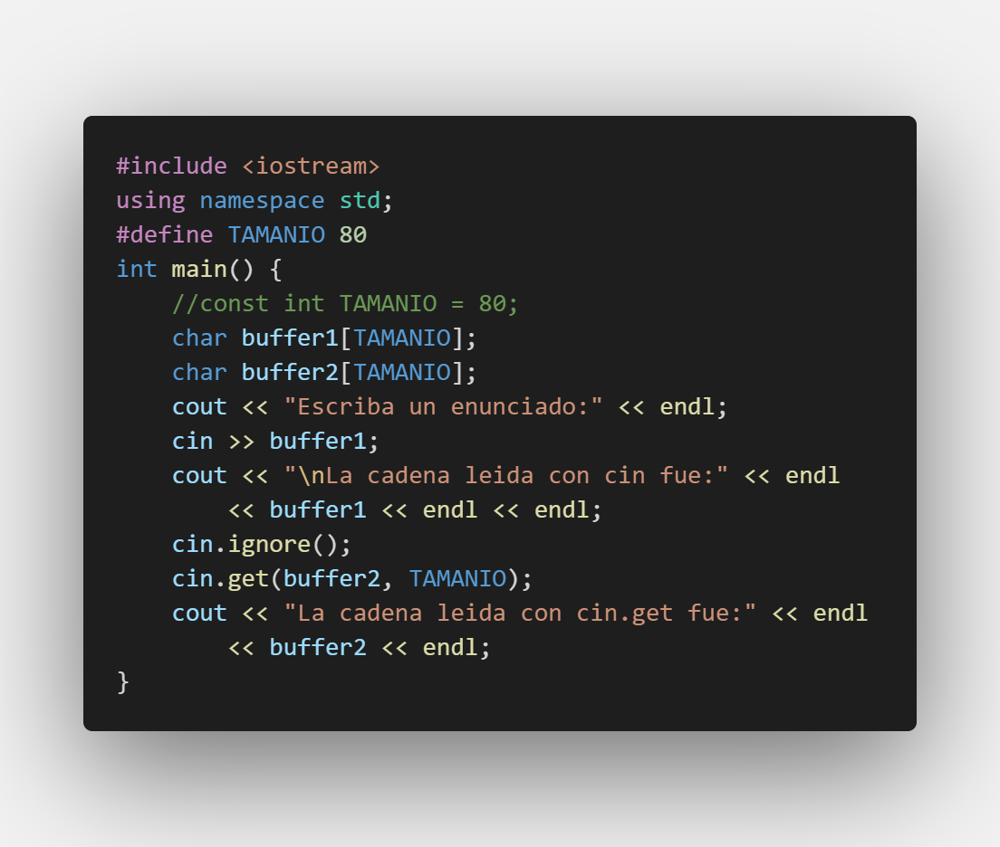
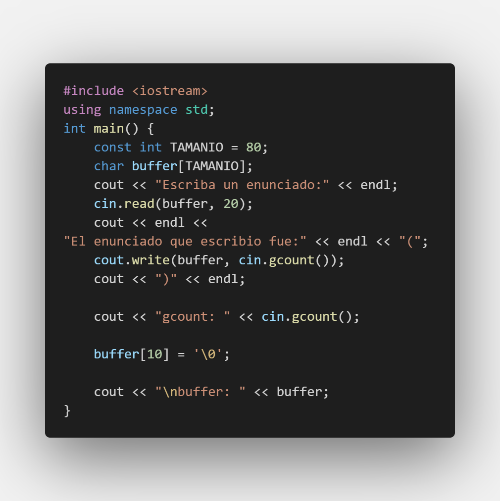
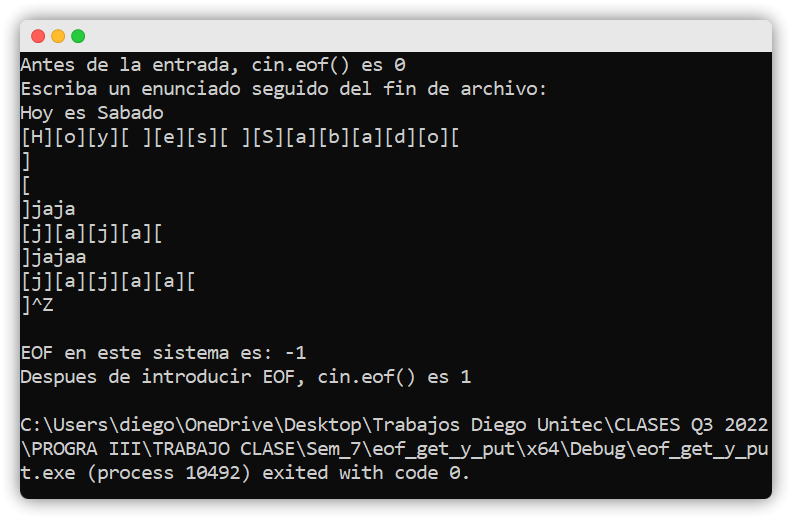

# Punto de Control #7

## :copyright: Autor

- :camera: 
>

- :technologist: **Diego Molina Valladares**
- :e-mail: diego.molina0801@gmail.com
- :link: [github.com/DiegoMolinaaa](https://github.com/DiegoMolinaaa)

---

## :dart: Objetivos

Un programa de **C++** diseñado para demostrar:

1. :nut_and_bolt: La diferencia en el uso de:
   - **static_cast** 
   - **dynamic_cast** 
   - **reinterpret_cast**
2. :books: La utilización de: 
    - `.hpp` (declaración)
    - `.cpp` (implementación)
3. :mag: La optimización de:
   - `#include` (mínimo requerido)
   - `using namespace std` (solo cuando se necesita)
4. :open_file_folder:La organización de:
   - Código (**Visual Studio Code** y Repositorio en **Github**)
   - Imágenes (Extensión **Polacode** de **VSC**)
   - Formato, Diagrama y Emojis (**Markdown** en **VSC**)
5. :memo: Utilizacion de Archivos:
   - De texto
6. :pencil2: Formatear y Validar:
   - Entrada y Salida de Flujos

---
## :black_circle: EOF, Get y Put

---

## :triangular_ruler: Cin y Cin-Get

---

## :white_large_square: Cin Getline

## :white_medium_square: Read y Write

---

## :large_blue_diamond: Dec, Hex, Oct y Setbase

---
## :small_blue_diamond: Raiz Cuadrada

---

## :large_orange_diamond: Cout Width

## :small_orange_diamond: Cout Setw

---

##  :black_large_square:  Cout Setw 2

---
## :black_medium_small_square: Scientific y Fixed

---

## :white_circle: ASCII

## :white_circle: Archivos Write

## :red_circle: Archivos Read

## :large_blue_circle: Acceso Aleatorio

---
## :large_blue_circle: Acceso Aleatorio Contacto.h

---
## :large_blue_circle: Acceso Aleatorio Contacto.cpp

---
## :large_blue_circle: Acceso Aleatorio V2

---
## :large_blue_circle: Acceso Aleatorio V2 Contacto.h

---
## :large_blue_circle: Acceso Aleatorio V2 Contacto.cpp

---
## :large_blue_circle: Acceso Aleatorio V2 Operaciones.h

---
## :large_blue_circle: Acceso Aleatorio V2 Operaciones.cpp

---
## Ejecuciones
--- 
## :black_circle: EOF, Get y Put Ejecucion

---

## :triangular_ruler: Cin y Cin-Get Ejecucion

---

## :white_large_square: Cin Getline Ejecucion

## :white_medium_square: Read y Write Ejecucion

---

## :large_blue_diamond: Dec, Hex, Oct y Setbase Ejecucion

---
## :small_blue_diamond: Raiz Cuadrada Ejecucion 1

---
## :small_blue_diamond: Raiz Cuadrada Ejecucion 2

---

## :large_orange_diamond: Cout Width Ejecucion

---
## :small_orange_diamond: Cout Setw Ejecucion

---

##  :black_large_square:  Cout Setw 2 Ejecucion

---
## :black_medium_small_square: Scientific y Fixed Ejecucion 

---

## :white_circle: ASCII Ejecucion 

---

## :white_circle: Archivos Write Ejecucion

## :red_circle: Archivos Read Ejecucion

## :large_blue_circle: Acceso Aleatorio Ejecucion

---

## :large_blue_circle: Acceso Aleatorio V2 Ejecucion

---
#### Herramientas:
- :package: [Visual Studio Code](https://code.visualstudio.com/)
- :camera: [Polacode-2020 v0.5.2](https://github.com/jeff-hykin/polacode)
- :notebook: [Markdown Cheatsheet](https://github.com/adam-p/markdown-here/wiki/Markdown-Cheatsheet)
- :smile: [Emoji Cheat Sheet](https://www.webfx.com/tools/emoji-cheat-sheet/)
